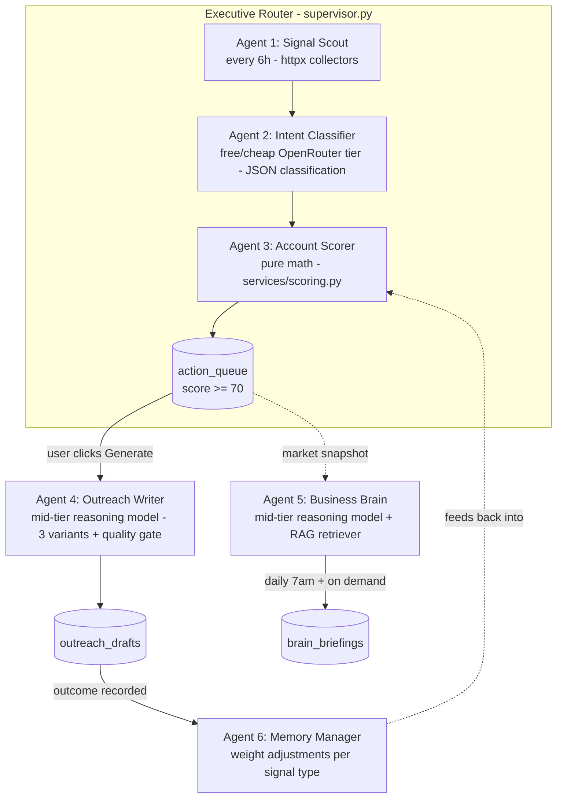

# NEXUS Intelligence — System Architecture

## Overview

NEXUS is two products sharing one data spine:

- **NEXUS BRAIN** — RAG-grounded strategic advisor (briefings, deal coaching, Q&A)
- **NEXUS INTENT** — 6-agent pipeline turning raw market signals into scored accounts
  with ready-to-send outreach

The full loop: **Monitor → Reason → Score → Act**, closed end to end.

## Agent pipeline

- **Sequencing:** LangGraph `StateGraph` when installed; identical sequential
  runner otherwise (`app/agents/graph.py`). Every node collects errors into a
  human-review channel instead of aborting the run.
- **Cost guardrail:** `CostTracker` (`app/core/llm_router.py`, file-backed) enforces
  a hard daily limit (`NEXUS_DAILY_LLM_LIMIT`, default $0.25). All LLM calls route
  through OpenRouter across cost tiers — a free tier and an ultra-cheap tier handle
  classification, a mid-tier reasoning model handles outreach and Brain Q&A, and
  Claude Opus is a premium fallback only on quality-gate or error escalation.
- **Demo mode:** with no `OPENROUTER_API_KEY`, every LLM call returns a
  deterministic grounded fallback; the classifier uses per-signal-type
  heuristics; the whole platform demos end to end.

## Data flow

1. **Collect** — Signal Scout hits SEC EDGAR (free/official), NewsAPI, Crunchbase
   (keyed), normalizes to `{company, signal_type, source, title, raw_data}`,
   dedupes, find-or-creates the `Account`, inserts `Signal(status="new")`.
2. **Classify** — the free OpenRouter tier (falling back to an ultra-cheap paid
   tier) labels urgency tier (HOT/WARM/COOL), budget implication, decision-maker
   involvement, action window; defensive JSON parsing with a rule-based
   heuristic as the guaranteed final fallback. `status → classified`.
3. **Score** — pure functions compute Urgency (recency decay × type weight ×
   concurrency), Fit (industry/size/geo/tech vs ICP), Budget Probability
   (additive type weights, cap 100). Composite = `u·f·b / 10000`. Accounts ≥ 70
   are upserted into the Action Queue with a window estimate.
4. **Act** — Outreach Writer builds three framed variants (assertive /
   analytical / challenger) anchored to the strongest signal, passes a quality
   gate (≤3 sentences, ≤7-word subject, must reference the signal, no banned
   phrases, no em dashes), regenerates once on violation, then falls back to a
   deterministic template that always passes.
5. **Learn** — Memory Manager credits/blames signal types per outreach outcome
   and maintains bounded weight adjustments in `Organization.settings`.

## Database schema (11 tables)

| Table | Purpose |
|---|---|
| `organizations` | Tenant root; plan, credits, learned settings (JSONB) |
| `users` | Members of an org |
| `icp_profiles` | Target industries/size/titles/geos/tech + offer description |
| `business_context_docs` | RAG corpus: proposals, case studies, pricing, win/loss |
| `accounts` | Monitored companies (per org) |
| `signals` | Detected triggers + classification fields |
| `account_scores` | Score snapshots with human-readable explanation |
| `action_queue` | Accounts ≥ 70 with window estimate + status lifecycle |
| `outreach_drafts` | 3-variant packages + sent/reply/outcome tracking |
| `brain_conversations` | Chat history |
| `brain_briefings` | Daily briefings (idempotent per org+date) |

Migrations: Alembic (`backend/alembic/versions/001_initial.py`).

## API surface

Mounted under `/api/v1` — see [api-reference.md](api-reference.md). MVP auth is
the `X-Org-Id` header resolved by a `get_current_org` dependency (falls back to
the seeded demo org); a real IdP (Clerk) slots in behind that dependency without
touching routers.

## Frontend

Next.js 14 App Router, TypeScript strict, Tailwind. Two route groups:

- **Marketing** (`/`, `/solo`, `/agency`, `/gtm`) — static, persona-specific
- **App** (`/app/*`) — Command Center, Action Queue, Brain, Account Profile,
  Signal Feed, Settings, 6-step Onboarding

Every data hook (TanStack Query) falls back to bundled demo fixtures when the
API is unreachable, so the frontend demos standalone. Live signals arrive via
`EventSource` on `/api/v1/signals/stream` with a demo-interval fallback.

## Model tier routing

All calls go through OpenRouter (`app/core/llm_router.py`) — one key, one SDK. See
that module's docstring and the README's routing table for the exact verified model
slugs and pricing (both drift; re-check against `openrouter.ai/api/v1/models` before
trusting either as current).

| Tier | Used for | Why |
|---|---|---|
| 0 — free | Signal classification (first attempt) | High volume, zero cost, best-effort |
| 1 — ultra-cheap | Signal classification (fallback) | Still near-free if tier 0 fails/errors |
| 2 — mid-tier | Outreach generation, Brain Q&A/briefings/coaching | Quality-critical, demand-driven |
| 3 — premium (Claude) | Outreach/Brain fallback only | Used only on quality-gate or error escalation |

Every tier ultimately backs onto a zero-cost, zero-network final fallback (the
rule-based heuristic classifier or the deterministic outreach template) that can
never fail outright.

## Deployment topology

- **Local:** `docker-compose up --build` → postgres:16, redis:7, qdrant,
  backend (uvicorn), frontend (standalone Next.js)
- **Production:** AWS via Terraform (`infrastructure/terraform/`) — ECS Fargate
  services behind an ALB, RDS PostgreSQL, ElastiCache Redis, S3, ECR, Secrets
  Manager; GitHub Actions CI (lint + tests + build) and gated deploy workflow
